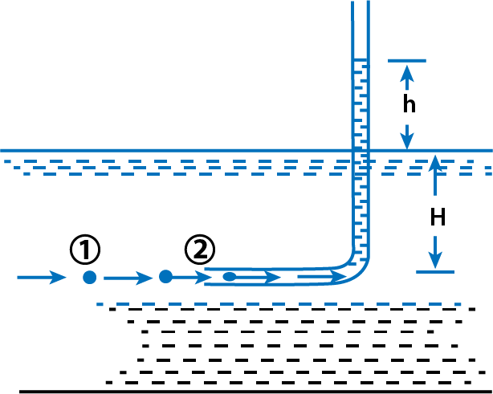

<h2>Pitot-Tube</h2>

 It is a device used for measuring the velocity of flow at any point in a pipe or a channel. It is based on the principle that if the velocity of flow at a point becomes zero, the pressure there is increased due to the conversion of the kinetic energy into pressure energy. In its simplest form, the pitot-tube consists of a glass tube, bent at right angles as shown in Fig. 1.

The lower end, which is bent through 90° is directed in the up- stream direction as shown in Fig. 1. The liquid rises up in the tube due to the conversion of kinetic energy into pressure energy. The velocity is determined by measuring the rise of liquid in the tube. 

Fig .1 Pitot-tube

Consider two points (1) and (2) at the same level in such a way that point (2) is just as the inlet of the pitot-tube and point (1) is far away from the tube.

Let

&emsp; p1 = intensity of pressure at point (1)  
&emsp; v1 = velocity of flow at (1)  
&emsp; p2 = pressure at point (2)  
&emsp; v2 = velocity at point (2), which is zero  
&emsp; H = depth of tube in the liquid  
&emsp; h = rise of liquid in the tube above the free surface.  

Applying Bernaulli's equation at points (1) and (2), we get

$$ \frac{p_1}{\rho_{g}} + \frac{v_1^2}{2g} + z_1 = \frac{p_2}{\rho_{g}} + \frac{v_2^2}{2g} + z_2 $$

But z1 = z2 as points (1) and (2) are on the same line and v2 = 0.

$$ \frac{p_1}{\rho_{g}} = pressure \ head \ at \ (1) = H $$

$$ \frac{p_2}{\rho_{g}} = pressure \ head \ at \ (2) = h + H $$

Substituting these values, we get

$$ \therefore \ \ \ \  H + \frac{v1_2}{2g} = (h + H) $$

$$ \therefore \ \ \ \  h = \frac{v1_2}{2g} \ \ or \ \ v_1 = \sqrt{2gh} $$

This is theoratical velocity. Actual velocity is given by

$$ (v_1)_{act} = C_v \sqrt{2gh} $$

where Cv = co-efficient of pitot tube.

